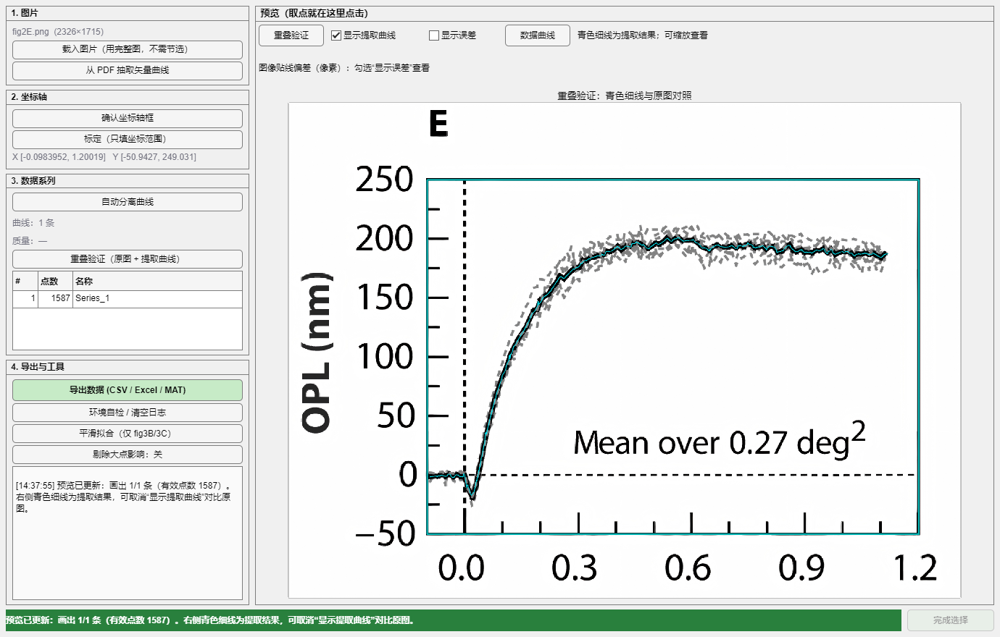
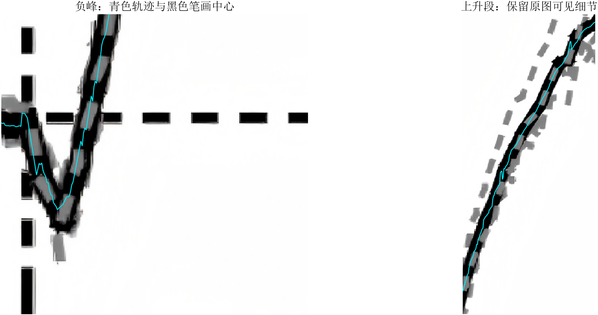
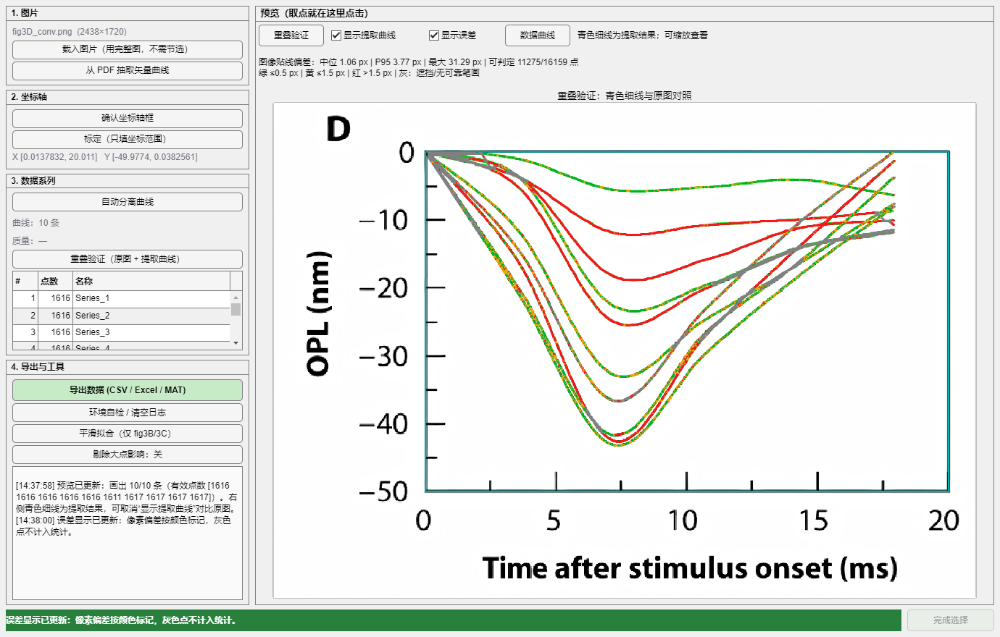

# CurveDigitizer · 曲线数字化工具

从图表图片中提取曲线，标定为数据坐标，核对后导出 CSV、Excel 或 MAT。提供 MATLAB 图形界面和示例批处理入口，适用于论文图表的数据整理与辅助复现。



*实际程序界面。左侧完成载入、标定、提取和导出；右侧可放大原图，切换提取轨迹及误差显示。*

[开始使用](#开始使用) · [操作步骤](#操作步骤) · [重叠验证与误差显示](#重叠验证与误差显示) · [批处理](#批处理) · [文件说明](#文件说明)

## 开始使用

### 运行环境

- **MATLAB 与 Image Processing Toolbox**。本包已在 Windows、MATLAB R2024a 上验证；其他版本尚未验证。
- 图形界面需要 MATLAB 桌面环境。图片提取与常规导出无需安装 Python，也无需安装 Microsoft Excel。
- 支持 PNG、JPG、JPEG、TIF、TIFF 和 BMP 图片。使用清晰的单幅图，尽量保留坐标轴与刻度。

完整解压后，将 MATLAB 的“当前文件夹”切换到包含 `app.m` 的目录，运行：

```matlab
app
```

程序只打开界面，不会自动批量提取。首次使用可运行 `selftest`，检查图像处理函数、示例提取和已知图片识别。

**试用示例：** 在界面中载入 `data/fig2E.png`，依次点击“确认坐标轴框”“标定（只填坐标范围）”“自动分离曲线”，按对话框提示继续。程序会识别随包示例并应用预设标定；仍需核对轴框和坐标范围。

## 操作步骤

| 步骤 | 操作 | 检查重点 |
| :--- | :--- | :--- |
| 1. 载入 | 点击“载入图片” | 多面板拼图先在外部裁成单幅；避免缩放压缩或截掉刻度 |
| 2. 确认轴框 | 点击“确认坐标轴框”，核对绘图区 | 边框应对应坐标轴，避免选中零线、图例或内部网格 |
| 3. 标定 | 填写坐标范围及名称、单位 | 数值应与选定轴框或刻度位置对应；范围不能直接用数据极值代替 |
| 4. 提取 | 点击“自动分离曲线”，按提示选择曲线 | 核对期望条数；手动点选时选择彼此分开、远离标记点的位置，最后点“完成选择” |
| 5. 核对 | 点击“重叠验证”，放大检查；可勾选“显示误差” | 检查峰谷、交叉、尖峰与遮挡处；“数据曲线”可打开独立坐标图 |
| 6. 导出 | 点击“导出数据”，确认名称、单位与保存位置 | 重新提取后应重新核对；导出文件中保留来源信息 |

自己的图片不要命名为 `fig2E` 或 `fig3A`～`fig3F`，这些名称用于随包示例的预设识别，可能导致错误套用标定。

### fig2E 的中心线提取

fig2E 提取黑色均值曲线，排除浅灰记录的干扰。在可靠的黑色笔画段定位上下边界并取中点，避免轨迹长期偏向笔画上缘，尤其改善前段负峰的位置。灰色记录覆盖导致的残缺笔画会被筛除，短缺失段用两侧可靠位置直线补齐。



*局部放大图，青色为当前提取结果。此图用于检查笔画中心位置，不代表已获得实验真值。*

fig2E、fig3B、fig3C、fig3D、fig3E 的当前提取分支不启用平滑后处理；fig3A 保留原有光滑先验，fig3F 保留逐列颜色重吸附。界面的“平滑拟合”是手动可选工具，会改变提取坐标；需要保留原图起伏时不要开启。插补与平滑是不同操作，插补位置仍需结合原图检查。

## 重叠验证与误差显示

“重叠验证”将数据坐标反算回图片像素坐标，在原图上画出**青色细线**。取消“显示提取曲线”即可查看原图；勾选后恢复当前叠加层。可通过预览区的缩放工具检查细节。

勾选“显示误差”后，轨迹改用彩色点显示与图像笔画中心的**法向像素偏差**。顶部给出中位数、P95、最大值和可判定点数；取消后恢复青色线。两个显示开关均不会修改导出的坐标。



| 颜色 | 含义 |
| :--- | :--- |
| 绿色 | 偏差 ≤ 0.5 px |
| 黄色 | 0.5 px < 偏差 ≤ 1.5 px |
| 红色 | 偏差 > 1.5 px |
| 灰色 | 遮挡、同色曲线合并或缺少可靠笔画，无法判定；不计入统计 |

**如何读统计：** P95 表示 95% 的可判定点不超过该偏差。可判定点数较少时，即使统计偏差很小，也应检查灰色区域。像素偏差衡量图像贴线程度，不包含坐标标定误差，也不是实验测量误差或整体提取精度的证明。

## 导出与读取

界面通常输出以下文件。Excel 写出异常时，程序会给出警告，其他成功写出的格式仍可使用。

| 文件 | 内容 |
| :--- | :--- |
| `<名称>.csv` | 每条曲线一对 X/Y 列，列名包含曲线名称或单位 |
| `<名称>.xlsx` | `ALL` 汇总表和各曲线工作表 |
| `<名称>.mat` | `curves`、轴标签 `lab`、标定 `cal`、轴框 `ax` |
| `<名称>_provenance.txt` | 源图片路径、导出时间、轴范围、曲线列表和方法说明 |

```matlab
% 读取界面导出的 MAT 文件（将路径改为自己的导出文件）
D = load('my_curve.mat');
plot(D.curves(1).X, D.curves(1).Y);
xlabel('X'); ylabel('Y'); grid on;
```

曲线编号不自动对应实验条件，应人工确认名称和单位。科研引用时注明“数据由图示数字化得到”，并保留原图、标定信息与核对结果。

## 批处理

`run_all` 使用 `data/` 中的七张示例图和预设参数，不会扫描任意新图片。以下写法将新输出保存到独立目录，方便保留随包参考结果：

```matlab
% 提取全部示例
OUT = run_all('outdir', 'output/data', 'qadir', 'output/qa');

% 只提取 fig2E 与 fig3D；关闭 Excel 导出
OUT = run_all('figures', {'fig2E', 'fig3D'}, 'xlsx', false, ...
              'outdir', 'output/data', 'qadir', 'output/qa');
```

无参数的 `run_all` 会输出到 `digitized_final/` 和 `qa/`，覆盖同名文件。`'csv', false` 会同时关闭 CSV 与 Excel 导出，MAT 和核对产物仍会生成。

| 示例 | 预设曲线数 | 图像特点 |
| :--- | ---: | :--- |
| fig2E | 1 | 黑色均值曲线、灰色记录与局部覆盖 |
| fig3A | 7 | 同色相、不同深浅的曲线族 |
| fig3B | 2 | 蓝红曲线、圆点和误差棒 |
| fig3C | 2 | 蓝红曲线及散点 |
| fig3D | 10 | 汇聚、交叉的同色曲线族 |
| fig3E | 2 | 蓝红曲线及误差棒 |
| fig3F | 2 | 密集锯齿和尖峰 |

批处理生成 `<tag>.mat`、宽表 `<tag>.csv`、长表 `<tag>_long.csv` 和 `<tag>.xlsx`。宽表按 `x1,y1,x2,y2,…` 排列，长表使用 `series,x,y` 列。**批处理 MAT 使用 `CR`，与界面导出的 `curves` 不同。**

```matlab
D = load(fullfile('digitized_final', 'fig3D.mat'));
plot(D.CR(1).X, D.CR(1).Y);

% run_all 的返回值可直接用于绘图
plot(OUT(1).curves(1).X, OUT(1).curves(1).Y);
```

核对目录会生成原图叠加 `<tag>_overlay.png`、独立重绘 `<tag>_render.png`、遗漏笔画图 `linegap_<tag>.png` 及 `QC_report.txt`。覆盖率仅衡量路径对图像笔画的认领情况，不能单独证明坐标准确或曲线身份正确。

## 文件说明

```text
CurveDigitizer_fig2E_fixed/
├── README.md                 使用说明
├── app.m                     界面启动入口
├── digitizer_app.m           界面、交互、验证和导出
├── curve_extract.m           提取主算法
├── black_stroke_center.m     fig2E 黑色笔画中心定位
├── targeted_trace.m          标记点和同色曲线校正
├── curve_image_error.m       图像贴线偏差计算
├── extract_opts.m            示例提取参数
├── fig_specs_v2.m            示例轴框、量程、曲线数量
├── run_all.m                 示例批处理入口
├── selftest.m / verify_all.m 自检与综合诊断
├── tools/                    追踪、标定、OCR 等辅助工具
├── data/                     示例输入与图片识别参考
├── digitized/                界面读取的参考轨迹
├── digitized_final/          参考结果和默认批处理数据目录
├── qa/                       核对产物目录（随包为空）
└── docs/images/              本说明使用的实际界面截图
```

根目录中的其他 `.m` 文件为算法辅助函数或诊断入口。`data/`、`tools/`、`digitized/` 和 `digitized_final/` 存在程序引用，应随项目完整保留。`qa/` 保留空目录供诊断函数写入，`_app_log.txt` 在运行时生成；发行包不预装历史核对图或日志。`render_check` 生成的 `<tag>_check.png` 固定写入 `qa/`，即使批处理指定了其他核对目录。

## 验证与排查

```matlab
selftest       % 环境依赖、七张示例与已知图片识别
verify_all     % 全量提取、笔画覆盖、标定、边界与缩放诊断
```

`verify_all` 会重新生成默认结果并写入 `qa/VERIFY_report.txt`。它会捕获并记录异常，因此“验证结束”不等于全部检查通过，应查看报告中的失败项和异常指标。

| 现象 | 处理建议 |
| :--- | :--- |
| 提示缺少 `bwdist`、`bwmorph` 等函数 | 检查 Image Processing Toolbox，确认已完整解压并从项目根目录运行 |
| 曲线跳线、贴近圆点或漏掉尖峰 | 放大重叠验证，检查轴框、条数和种子位置；在清晰且彼此分开的区域重新点选 |
| 曲线形状一致，数值整体偏移 | 核对轴框与所填范围的对应位置，尤其是零刻度与绘图区边界的区别 |
| 误差统计很小，但有大片灰点 | 灰点没有可靠笔画证据，未参与统计；重点人工检查这些区域 |
| 遮挡处仍显示连续曲线 | 可能来自插补或端点延伸，不能将连续性视为直接观测 |
| Excel 文件未生成 | 查看写出警告，并检查目标文件是否被占用；可先使用 CSV 或 MAT |
| PDF 按钮提示缺少模块 | 当前包未提供 `extract_pdf_figure.m`；先将 PDF 图表保存为清晰图片后载入 |

主流程不依赖 OCR，名称与单位由用户填写。界面的环境检查包含可选 OCR 与外部模块检查，相关提示不必然意味着图片提取失败，可结合命令行 `selftest` 定位。

本项目使用线性像素到数据坐标映射，不直接适用于对数坐标。低分辨率、同色重叠、粗标记点和误差棒可能造成歧义；预设参数主要针对随包示例，处理其他图片时应重新标定并核对结果。
